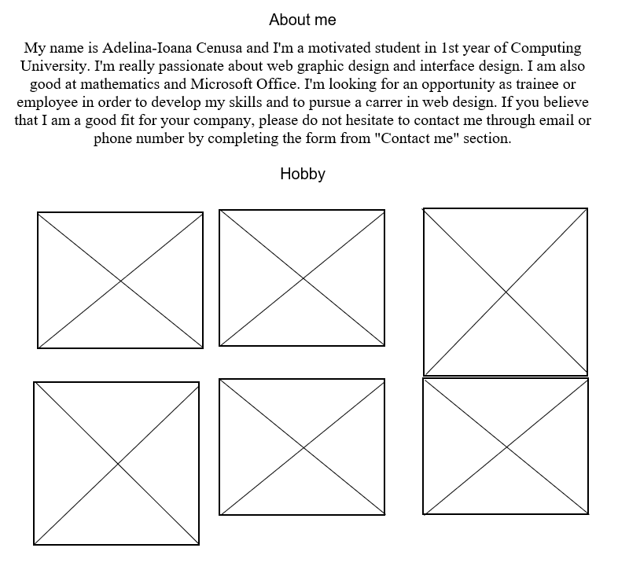
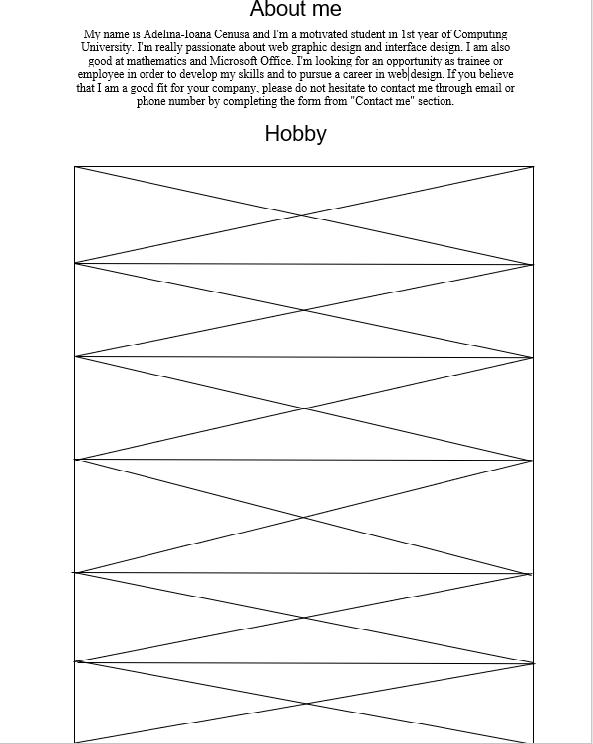
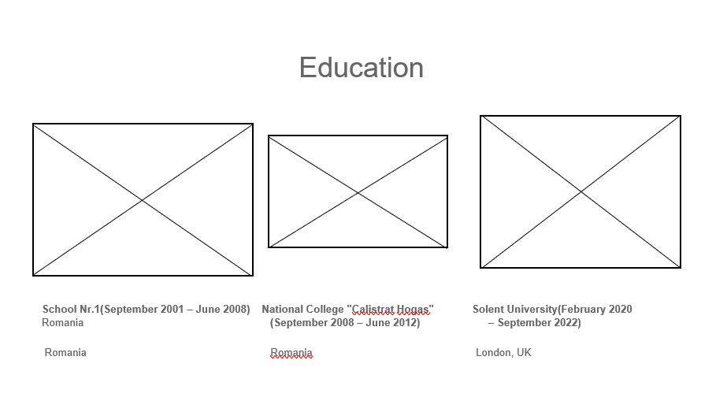
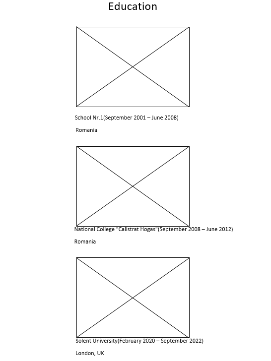
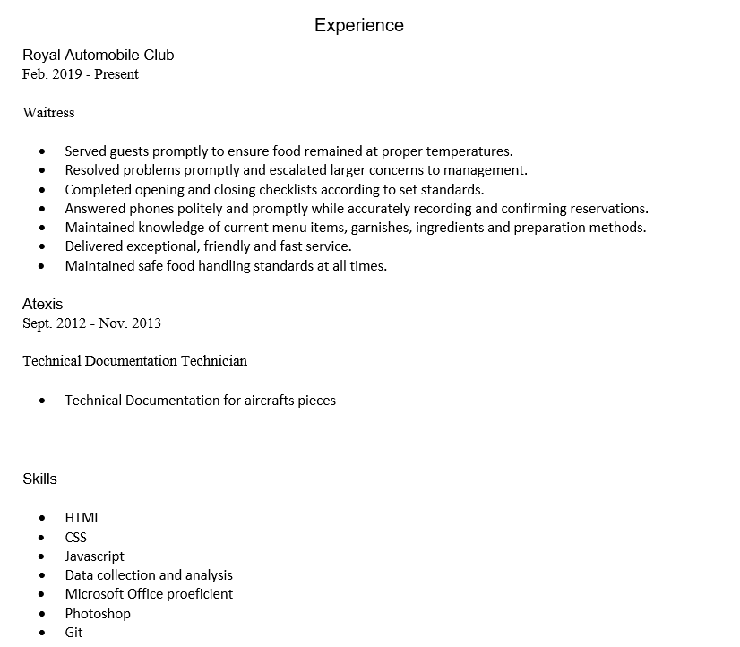
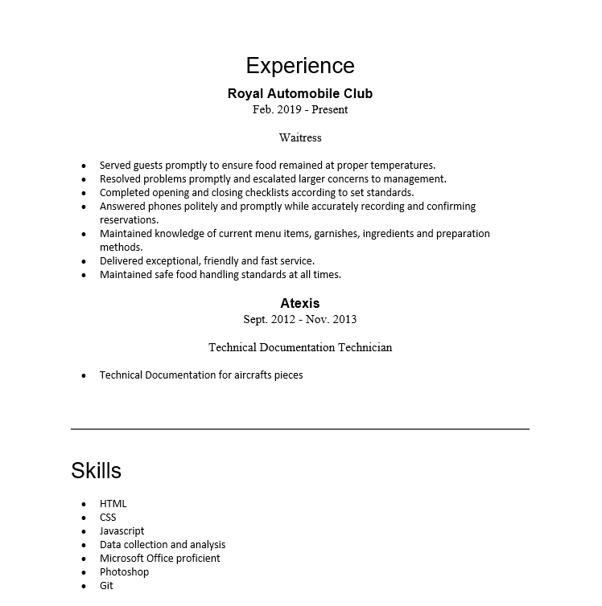
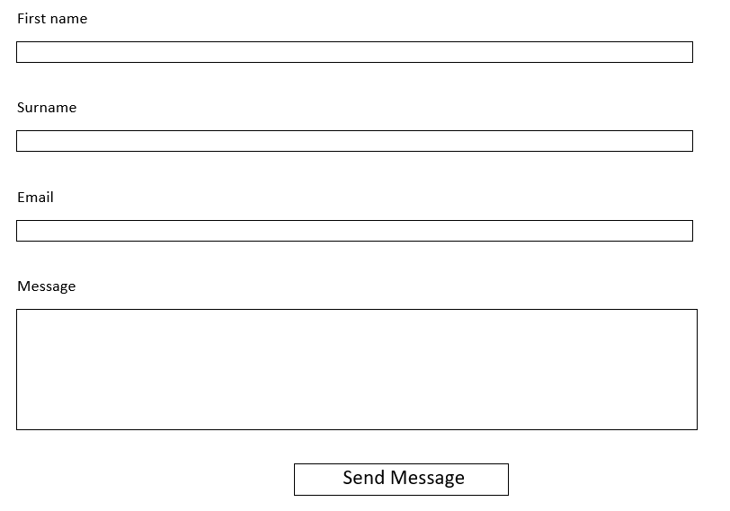
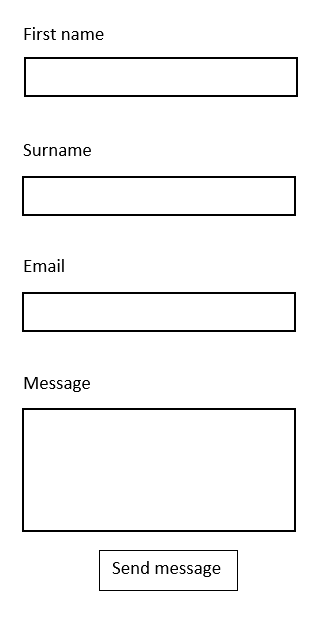

#Web Technologies - CV

## 1.1.1 Background
I chose to do my own CV because I'm looking for a job which can 
improve my skills and develop my knowledges. I really need a chance
to start to practice everything what I'm learning in University
because I want to pursue a career in IT. Nevertheless, I would be 
happy to work in a similar job, because I am also good at mathematics, Excel,
Word, Access and PowerPoint. I'm willing to learn new things and to
increase my knowledges with different domains of activity. 

## 1.1.2 Wire Frames

## 1.1.3 Colour Choices
Across my entire website I have used a combination of different images
and colours.
Mostly, I have used white background with grey text to create a good 
contrast and to keep it simple. Also, I have used white, grey or black 
text according to the background to make everything visible and easy
to read.
For my first page I have used a picture for background.
For "About me" page, I have used different pictures to represent some
of my hobbies because I think is more interesting to illustrate this
in picture instead of words because the pictures in general gives more
colour to the page.
For "Education" page, I have used 3 pictures to represent the school
where I have study from the past till now. 
The "Experience" page I just kept it simple, I have used a grey colour
for the text, a white colour for the background and I did not use any
additional colour.
For "Contact me" page, I have created a form and I have used the orange
colour for the form background because I did want to create a strong
contrast between form and the page background which is white.

## 1.1.4 Accessibility

I have used alternative text for the pictures from "Education" page 
to suggest where are and what is the name of each school. Also, I have
used strong colour for the form and I have tried to make a big contrast
between text and background. I did not put additional text for hobby's
pictures, but I have used very representative images which include the
name of each hobby.

## 1.2.5 GDPR
This is not applying in my case, because I am not using the personal 
data of those persons which will contact me.

## 1.2.6 Distance Selling

My website does not require any conformance with this because I am 
not selling any products. 

## 1.2.7 Evaluation

I chose to do my CV because it can help me in the future. I have created
four different hyperlinks which drives you to different pages.

I managed to make the whole website responsive for all devices, even if 
I had some problems with CSS because I did not know which margin to 
choose to make my site to look presentable, but I have tried different
values and in the end I think I did find the good ones.

Also, I had some problems with the contrast, because I tried to make it accessible
for everyone and I spent a little bit of time to find a good combination
between colours and images. 

I have used Chrome device toolbar to help me test my website in 
different screen sizes and I tried it on my physical devices also.
When I reduced the screen, I did set the break point on 400px so when
the screen it gets to that size the page is still responsive and all 
the hyperlinks remain in the same position.

I got some inspiration in creating my website from : https://speckyboy.com/.
I have pushed my entire project on GitHub.
My repository: https://github.com/AdelinaCenusa/WebTechnologies---Assessment.git

